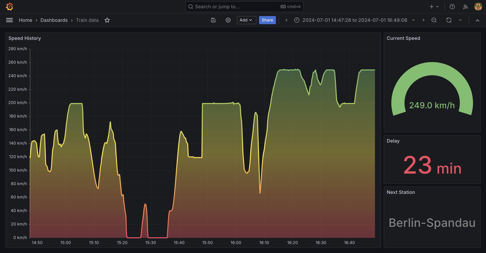

# DB train metrics

This repository allows to visualize data of the current trip when
travelling on board of a DB train. It visualizes speed and delay
and displays information about the current train and next station.

## Requirements

> [!NOTE]
> You must be connected to a `WIFIOnICE` network in order for this
> repository to work since it fetches all relevant information from
> DB Onboard APIs.

* [Docker](https://docs.docker.com/get-docker/)
* Connection to [`WIFIonICE` network](https://int.bahn.de/en/trains/wifi)

## Usage

1. Clone the repository
2. Run `docker compose up -d`
3. Open Grafana at <http://localhost:9772> in your browser
4. Login with default credentials (`admin`/`admin`)
5. Add a new [Prometheus data source](https://grafana.com/docs/grafana/latest/datasources/prometheus/configure-prometheus-data-source/)
   * Prometheus server URL: `http://prometheus:9090`
6. Add a new [dashboard](https://grafana.com/docs/grafana/latest/dashboards/build-dashboards/import-dashboards/)
   * Select _New_ > _Import_
   * Paste the contents from [grafana-dashboard.json](grafana-dashboard.json)
   * Select the Prometheus data source

## Stack

* [Prometheus](https://prometheus.io/) as data source
* [Grafana](https://grafana.com/) for visualization
* [Python](https://www.python.org/) script as bridge between DB Onboard API and Prometheus
* [Docker](https://www.docker.com/) for containerization
