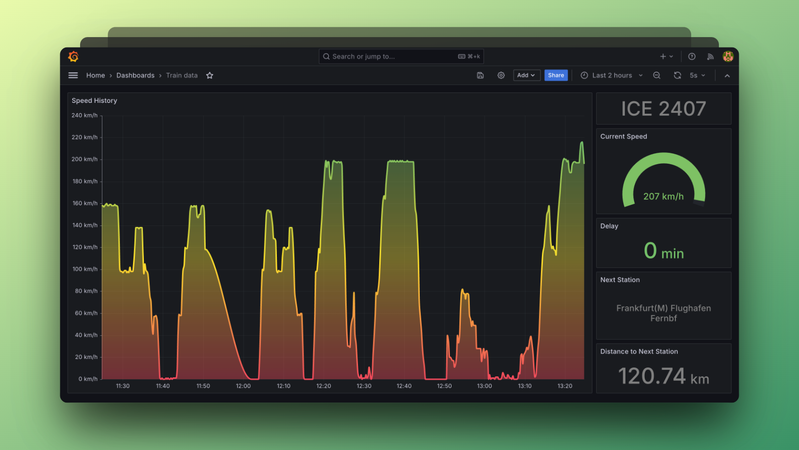

# DB train metrics

This repository allows to visualize data of the current trip when
travelling on board of a DB train. It visualizes speed and delay
and displays information about the current train and next station.

## Requirements

> [!NOTE]
> You must be connected to a `WIFIonICE` network in order for this
> repository to work since it fetches all relevant information from
> DB Onboard APIs.

* [Docker](https://docs.docker.com/get-docker/)
* Connection to [`WIFIonICE` network](https://int.bahn.de/en/trains/wifi)

## Usage

> [!TIP]
> Since bandwidth on trains is limited, it is recommended to pull all
> necessary Docker images prior to boarding the train. Just clone the
> repository and run `docker compose build --pull`.

1. Clone the repository
2. Run `docker compose up -d`
3. Open Grafana at <http://localhost:9772> in your browser

## Troubleshooting

If your dashboard doesn't receive any data make sure that you are
really connected to the ICE Wifi and that you can access
[iceportal.de](https://iceportal.de) in  your browser.

You can also check for connection problems by running
`docker compose logs -f bridge`. The logs should show failed requests
to fetch JSON from <https://iceportal.de/api1/rs/status>
and <https://iceportal.de/api1/rs/tripInfo/trip>.

Unfortunately, the connection to the DB Onboard API is not very stable
and may not always work.

## Stack

* [Prometheus](https://prometheus.io/) as data source
* [Grafana](https://grafana.com/) for visualization
* [Python](https://www.python.org/) script as bridge between DB Onboard API and Prometheus
* [Docker](https://www.docker.com/) for containerization
